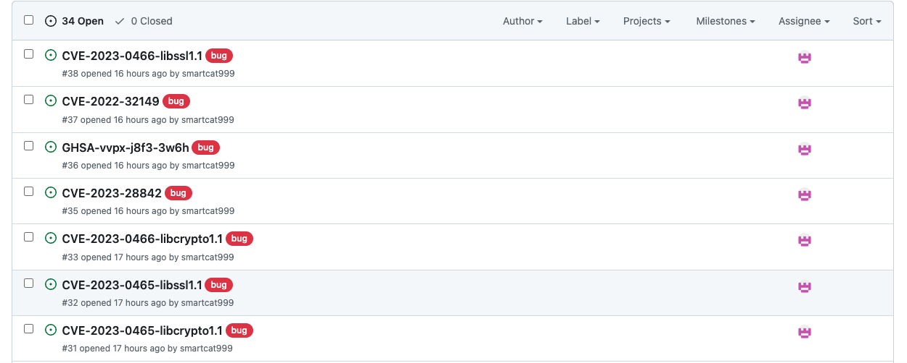

# github-helper

##### 1. Build
```shell
make build-local
```
##### 2. Run
```shell
# upload image cve scan report(result.sarif). Generate security issue to github repo.
mv ./target/release/github-helper /usr/local/bin/gctl
gctl issues new -f ./result.sarif --token <github-token> --owner <owner> --repo <repo>
```
##### 3. Result


